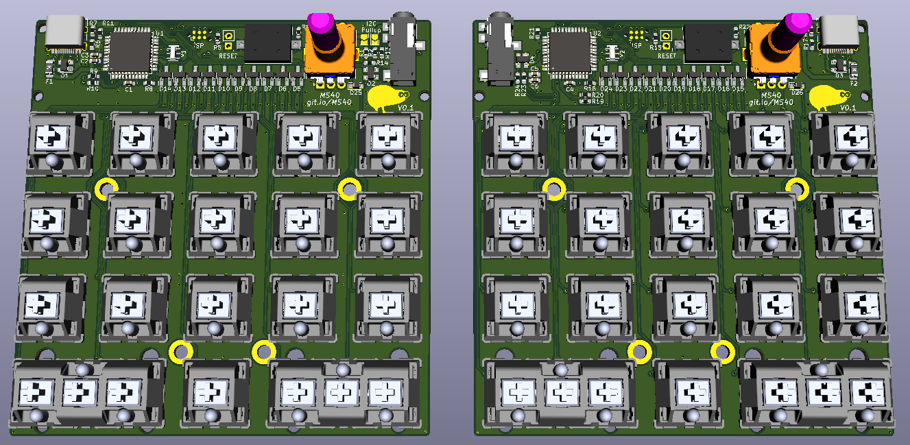
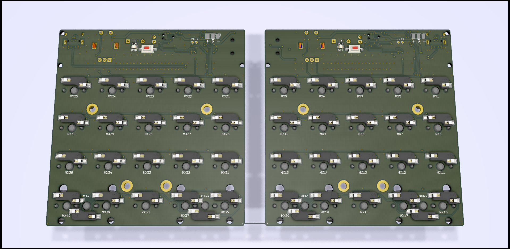

View this project on [CADLAB.io](https://cadlab.io/project/2268). 

# MS40

[Interactive BOM](https://duckle29.github.io/MS40/ibom.html)

The project uses Ai03s keyswitch library.
Many thanks to Ai03 for releasing an awesome keyswitch library with an entirely open license.
